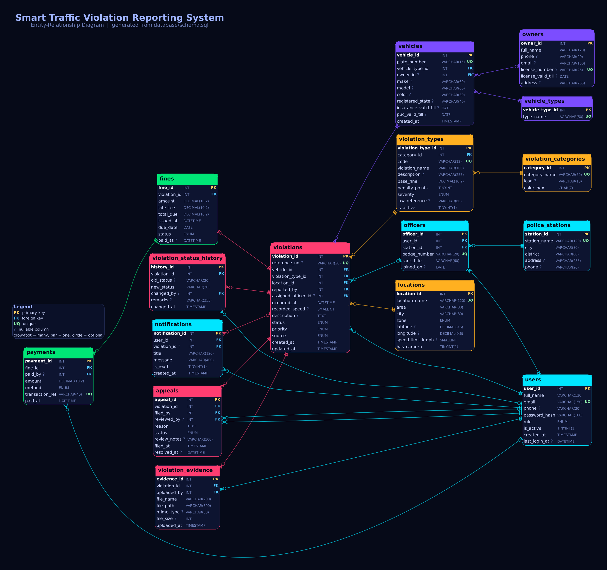
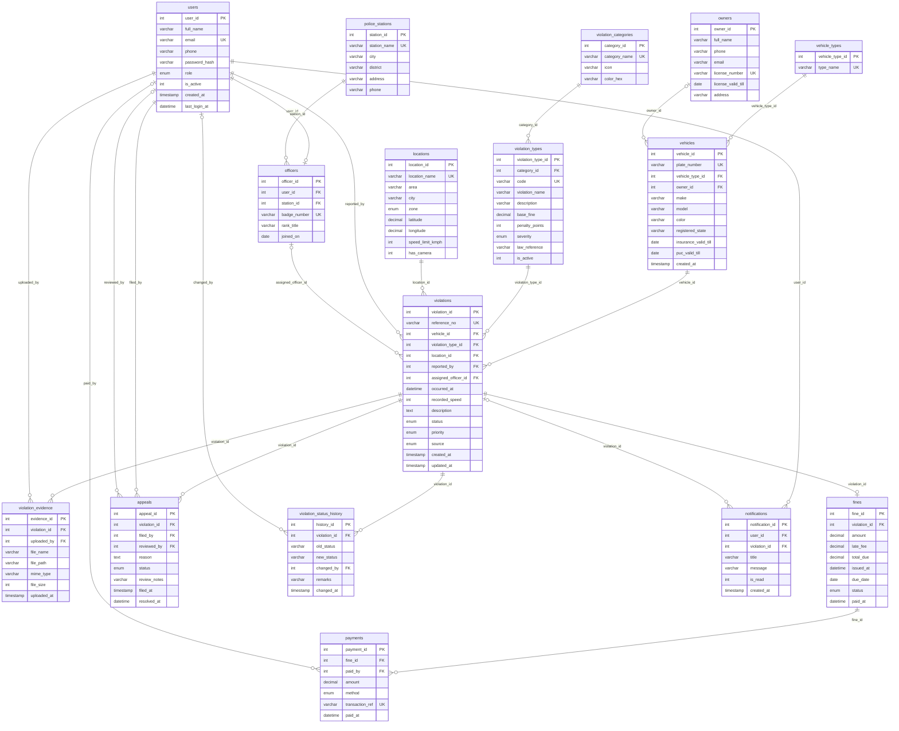

# Entity-Relationship Diagram

> Generated from [`database/schema.sql`](../database/schema.sql) by `docs/generate_er.py`.
> Re-run `python3 docs/generate_er.py` after changing the schema.

*(Vector version: [`er-diagram.svg`](er-diagram.svg). The same diagram is shown live inside the web app on the **Database** page.)*

## Relationships

| Parent (one) | Child (many) | Via | Meaning |
|---|---|---|---|
| `police_stations` | `officers` | `station_id` | A station has many officers |
| `users` | `officers` | `user_id` (unique) | An officer account extends exactly one user (1 : 1) |
| `owners` | `vehicles` | `owner_id` | An owner can hold many vehicles |
| `vehicle_types` | `vehicles` | `vehicle_type_id` | Classification of vehicles |
| `violation_categories` | `violation_types` | `category_id` | Rulebook grouped into categories |
| `vehicles` | `violations` | `vehicle_id` | A vehicle can be reported many times |
| `violation_types` | `violations` | `violation_type_id` | Which offence was committed |
| `locations` | `violations` | `location_id` | Where it happened |
| `users` | `violations` | `reported_by` | Who reported it (citizen / officer / admin) |
| `officers` | `violations` | `assigned_officer_id` | Officer handling the case (optional) |
| `violations` | `violation_evidence` | `violation_id` | Photos / proof attached to a case |
| `violations` | `fines` | `violation_id` (unique) | A verified violation has at most one fine (1 : 0..1) |
| `fines` | `payments` | `fine_id` | A fine can be settled in one or more payments |
| `violations` | `appeals` | `violation_id` | Owner disputes of a violation |
| `violations` | `violation_status_history` | `violation_id` | Audit trail of every status change |
| `users` | `notifications` | `user_id` | In-app notifications |

## Normalisation

* **1NF** - every column is atomic; no repeating groups (evidence, payments, appeals and history live in their own tables).
* **2NF** - every non-key attribute depends on the whole primary key (all tables use a single-column surrogate key).
* **3NF** - no transitive dependencies: vehicle details live in `vehicles`, owner details in `owners`, fine amounts in `violation_types`/`fines`, place data in `locations`, category data in `violation_categories`. `violations` stores only keys and facts about the incident itself.

## Database objects beyond tables

| Object | Purpose |
|---|---|
| `v_violation_details` | Flat, joined view used by the list / detail screens |
| `v_vehicle_offence_summary` | Per-vehicle totals: violations, penalty points, fines, outstanding amount |
| `sp_issue_fine(violation_id)` | Computes and inserts the fine (base fine + over-speed surcharge), idempotent |
| `trg_violations_bi` | Rejects violations dated in the future |
| `trg_violations_ai` / `trg_violations_au` | Write the audit trail into `violation_status_history` |
| `trg_payments_ai` | Marks the fine **Paid** and closes the violation once fully paid |
| `fines.total_due` | Generated column (`amount + late_fee`) |
| `CHECK` constraints | Non-negative fines, penalty points <= 12, valid latitude / longitude |

## Mermaid version (renders natively on GitHub)

## Data dictionary

### `police_stations`

| Column | Type | Key | Null |
|---|---|---|---|
| `station_id` | INT | PK | no |
| `station_name` | VARCHAR(120) | UNIQUE | no |
| `city` | VARCHAR(80) |  | no |
| `district` | VARCHAR(80) |  | no |
| `address` | VARCHAR(255) |  | yes |
| `phone` | VARCHAR(20) |  | yes |

### `users`

| Column | Type | Key | Null |
|---|---|---|---|
| `user_id` | INT | PK | no |
| `full_name` | VARCHAR(120) |  | no |
| `email` | VARCHAR(150) | UNIQUE | no |
| `phone` | VARCHAR(20) |  | yes |
| `password_hash` | VARCHAR(100) |  | no |
| `role` | ENUM |  | no |
| `is_active` | TINYINT(1) |  | no |
| `created_at` | TIMESTAMP |  | no |
| `last_login_at` | DATETIME |  | yes |

### `officers`

| Column | Type | Key | Null |
|---|---|---|---|
| `officer_id` | INT | PK | no |
| `user_id` | INT | FK -> users.user_id, UNIQUE | no |
| `station_id` | INT | FK -> police_stations.station_id | no |
| `badge_number` | VARCHAR(20) | UNIQUE | no |
| `rank_title` | VARCHAR(60) |  | no |
| `joined_on` | DATE |  | yes |

### `owners`

| Column | Type | Key | Null |
|---|---|---|---|
| `owner_id` | INT | PK | no |
| `full_name` | VARCHAR(120) |  | no |
| `phone` | VARCHAR(20) |  | yes |
| `email` | VARCHAR(150) |  | yes |
| `license_number` | VARCHAR(25) | UNIQUE | yes |
| `license_valid_till` | DATE |  | yes |
| `address` | VARCHAR(255) |  | yes |

### `vehicle_types`

| Column | Type | Key | Null |
|---|---|---|---|
| `vehicle_type_id` | INT | PK | no |
| `type_name` | VARCHAR(50) | UNIQUE | no |

### `vehicles`

| Column | Type | Key | Null |
|---|---|---|---|
| `vehicle_id` | INT | PK | no |
| `plate_number` | VARCHAR(15) | UNIQUE | no |
| `vehicle_type_id` | INT | FK -> vehicle_types.vehicle_type_id | no |
| `owner_id` | INT | FK -> owners.owner_id | yes |
| `make` | VARCHAR(60) |  | yes |
| `model` | VARCHAR(60) |  | yes |
| `color` | VARCHAR(30) |  | yes |
| `registered_state` | VARCHAR(40) |  | yes |
| `insurance_valid_till` | DATE |  | yes |
| `puc_valid_till` | DATE |  | yes |
| `created_at` | TIMESTAMP |  | no |

### `violation_categories`

| Column | Type | Key | Null |
|---|---|---|---|
| `category_id` | INT | PK | no |
| `category_name` | VARCHAR(60) | UNIQUE | no |
| `icon` | VARCHAR(10) |  | yes |
| `color_hex` | CHAR(7) |  | no |

### `violation_types`

| Column | Type | Key | Null |
|---|---|---|---|
| `violation_type_id` | INT | PK | no |
| `category_id` | INT | FK -> violation_categories.category_id | no |
| `code` | VARCHAR(12) | UNIQUE | no |
| `violation_name` | VARCHAR(100) |  | no |
| `description` | VARCHAR(255) |  | yes |
| `base_fine` | DECIMAL(10,2) |  | no |
| `penalty_points` | TINYINT |  | no |
| `severity` | ENUM |  | no |
| `law_reference` | VARCHAR(60) |  | yes |
| `is_active` | TINYINT(1) |  | no |

### `locations`

| Column | Type | Key | Null |
|---|---|---|---|
| `location_id` | INT | PK | no |
| `location_name` | VARCHAR(120) | UNIQUE | no |
| `area` | VARCHAR(80) |  | no |
| `city` | VARCHAR(80) |  | no |
| `zone` | ENUM |  | no |
| `latitude` | DECIMAL(9,6) |  | yes |
| `longitude` | DECIMAL(9,6) |  | yes |
| `speed_limit_kmph` | SMALLINT |  | yes |
| `has_camera` | TINYINT(1) |  | no |

### `violations`

| Column | Type | Key | Null |
|---|---|---|---|
| `violation_id` | INT | PK | no |
| `reference_no` | VARCHAR(20) | UNIQUE | yes |
| `vehicle_id` | INT | FK -> vehicles.vehicle_id | no |
| `violation_type_id` | INT | FK -> violation_types.violation_type_id | no |
| `location_id` | INT | FK -> locations.location_id | no |
| `reported_by` | INT | FK -> users.user_id | no |
| `assigned_officer_id` | INT | FK -> officers.officer_id | yes |
| `occurred_at` | DATETIME |  | no |
| `recorded_speed` | SMALLINT |  | yes |
| `description` | TEXT |  | yes |
| `status` | ENUM |  | no |
| `priority` | ENUM |  | no |
| `source` | ENUM |  | no |
| `created_at` | TIMESTAMP |  | no |
| `updated_at` | TIMESTAMP |  | no |

### `violation_evidence`

| Column | Type | Key | Null |
|---|---|---|---|
| `evidence_id` | INT | PK | no |
| `violation_id` | INT | FK -> violations.violation_id | no |
| `uploaded_by` | INT | FK -> users.user_id | no |
| `file_name` | VARCHAR(200) |  | no |
| `file_path` | VARCHAR(300) |  | no |
| `mime_type` | VARCHAR(80) |  | yes |
| `file_size` | INT |  | yes |
| `uploaded_at` | TIMESTAMP |  | no |

### `fines`

| Column | Type | Key | Null |
|---|---|---|---|
| `fine_id` | INT | PK | no |
| `violation_id` | INT | FK -> violations.violation_id, UNIQUE | no |
| `amount` | DECIMAL(10,2) |  | no |
| `late_fee` | DECIMAL(10,2) |  | no |
| `total_due` | DECIMAL(10,2) |  | no |
| `issued_at` | DATETIME |  | no |
| `due_date` | DATE |  | no |
| `status` | ENUM |  | no |
| `paid_at` | DATETIME |  | yes |

### `payments`

| Column | Type | Key | Null |
|---|---|---|---|
| `payment_id` | INT | PK | no |
| `fine_id` | INT | FK -> fines.fine_id | no |
| `paid_by` | INT | FK -> users.user_id | yes |
| `amount` | DECIMAL(10,2) |  | no |
| `method` | ENUM |  | no |
| `transaction_ref` | VARCHAR(40) | UNIQUE | no |
| `paid_at` | DATETIME |  | no |

### `appeals`

| Column | Type | Key | Null |
|---|---|---|---|
| `appeal_id` | INT | PK | no |
| `violation_id` | INT | FK -> violations.violation_id | no |
| `filed_by` | INT | FK -> users.user_id | no |
| `reviewed_by` | INT | FK -> users.user_id | yes |
| `reason` | TEXT |  | no |
| `status` | ENUM |  | no |
| `review_notes` | VARCHAR(500) |  | yes |
| `filed_at` | TIMESTAMP |  | no |
| `resolved_at` | DATETIME |  | yes |

### `violation_status_history`

| Column | Type | Key | Null |
|---|---|---|---|
| `history_id` | INT | PK | no |
| `violation_id` | INT | FK -> violations.violation_id | no |
| `old_status` | VARCHAR(20) |  | yes |
| `new_status` | VARCHAR(20) |  | no |
| `changed_by` | INT | FK -> users.user_id | yes |
| `remarks` | VARCHAR(255) |  | yes |
| `changed_at` | TIMESTAMP |  | no |

### `notifications`

| Column | Type | Key | Null |
|---|---|---|---|
| `notification_id` | INT | PK | no |
| `user_id` | INT | FK -> users.user_id | no |
| `violation_id` | INT | FK -> violations.violation_id | yes |
| `title` | VARCHAR(120) |  | no |
| `message` | VARCHAR(400) |  | no |
| `is_read` | TINYINT(1) |  | no |
| `created_at` | TIMESTAMP |  | no |

